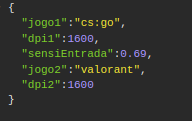

# Conversor de Sensibilidade para FPS'S

## Descrição

Este conversor serve para acabar com sua desculpa "Pinei porque a sensibilidade do jogo é diferente".
Para usar basta você informar a sensibilidade, nome jogo que você esta acostumado, o DPI do seu mouse e qual DPI que deseja usar no novo jogo, o resto deixa com o sistema.

## Como utilizar

- Para utilizar basta clonar o repositorio para sua maquina, no terminar instalar os pacotes necessarios com o comando "npm i".
- Com os pacotes instalados basta executar o arquivo index.js usando o comando "node ./src/index.js"
- Logo apos, abra seu navegador e cole o link "http://localhost:3000/jogos" para exibir os jogos que o sistema tem suporte.

- Para fazer suas converções é necessario usar o link "http://localhost:3000/converter", onde também vai ser preciso colocar no corpo da requisição as informações necessarias.

Neste caso o jogo de entrada é o CS:GO onde a sensibilidade do usuario neste jogo é de 0.69 com 1600 DPI, e ele deseja jogar valorant com a velocidade de movimento do seu mouse mais parecida o possivel com o jogo de entrada, o dpi que ele deseja utilizar é o mesmo da entrada.

- Com essas informações passadas ele vai conseguir jogar de uma forma que ele esta acostumado, basta copiar a sensibilidade passada no corpo da resposta e colar em seu jogo.

    Saida do programa:  (pode ser necessario trocar o "." por ",")